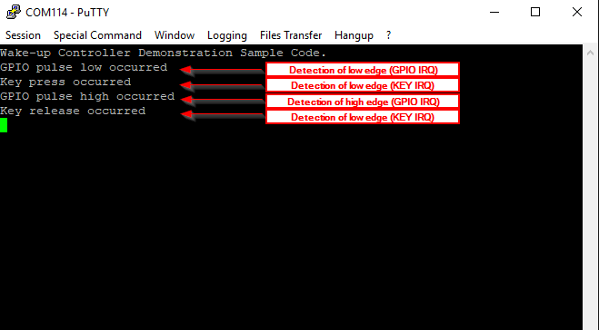

# WKUP Controller Demonstration

The key goal of this application is to demonstrate the use of the WakeUp controller. The controller consists of two sub blocks: 
1) The **KEY** block which incorporates a debounce circuitry (used for suppressing spikes produced by mechanical parts).
2) The **GPIO** sub block which does not incorporate a debounce circuitry. 

Both blocks can generate interrupts and trigger any master core (Cortex M33, CMAC M0+, SNC M0+) through the Power Domain Controller to exit from sleep. Please note that the interrupts produced by the wakeup controller can wakeup the system while in extended sleep mode. By default, the KEY sub block of the WKUP controller is demonstrated `WKUP_KEY_BLOCK_ENABLE`. User can also enable the GPIO P1 sub block by setting the  `WKUP_GPIO_P1_BLOCK_ENABLE` macro to 1. In the latter case, you may observe more than one non-debounced IO IRQs.

The GPIO_WAKEUP IRQs are implemented in both **Button 1** and **Button 2** if `WKUP_GPIO_P1_BLOCK_ENABLE` is set to (1) while KEY_WAKEUP IRQs are implemented only on **Button 1** if `WKUP_KEY_BLOCK_ENABLE` is set to (1). 

### HW & SW Configurations

- **Hardware Configurations**
  - This example runs on a DA1470x Bluetooth Smart SoC.
  - A DA1470x Pro Development Kit is needed for this example.
- **Software Configurations**
  - Download the latest SDK version for the DA1470x family of devices (10.0.10.x)
  - **SEGGER's J-Link** tools should be downloaded and installed.

## How to run the example

### Initial Setup

- Download the source code from the Support Website
- Import the project into your workspace.
- Connect the target device to your host PC.
- Compile the code (either in Release or Debug mode) and load it into the chip.
- Open a serial terminal (115200/8 - N - 1)
- Press the reset button on DA1470x daughterboard to start executing the application.
- Press and then release the **Button 1** button on the Pro DevKit. You should expect to get the following output on the serial console:

## Known Limitations

There are no known limitations for this sample code.
